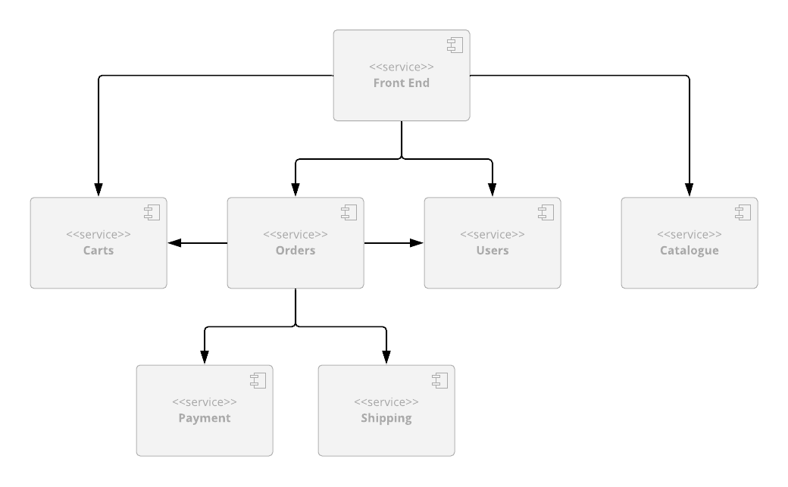
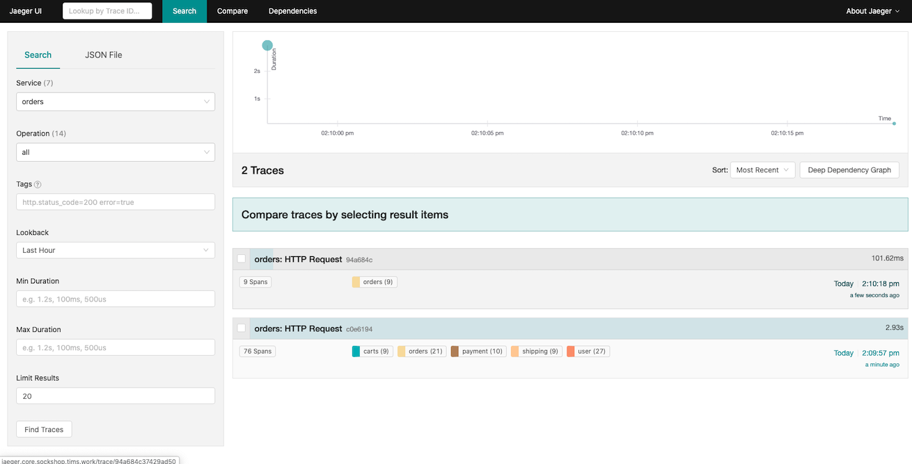
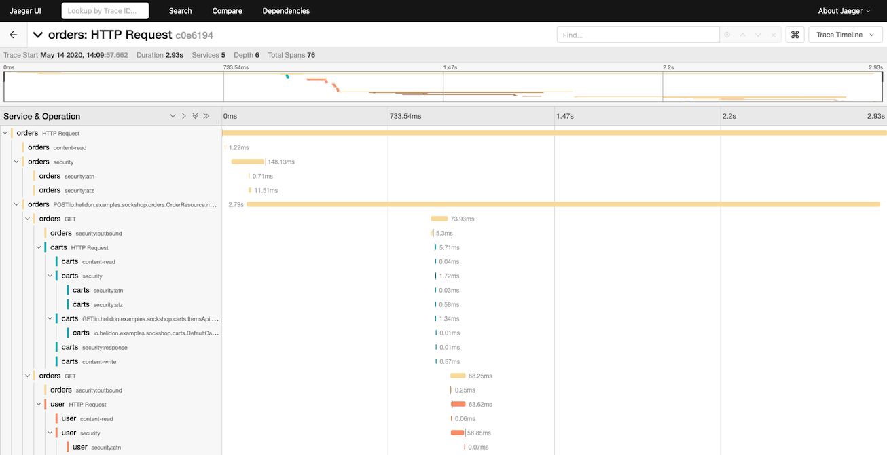
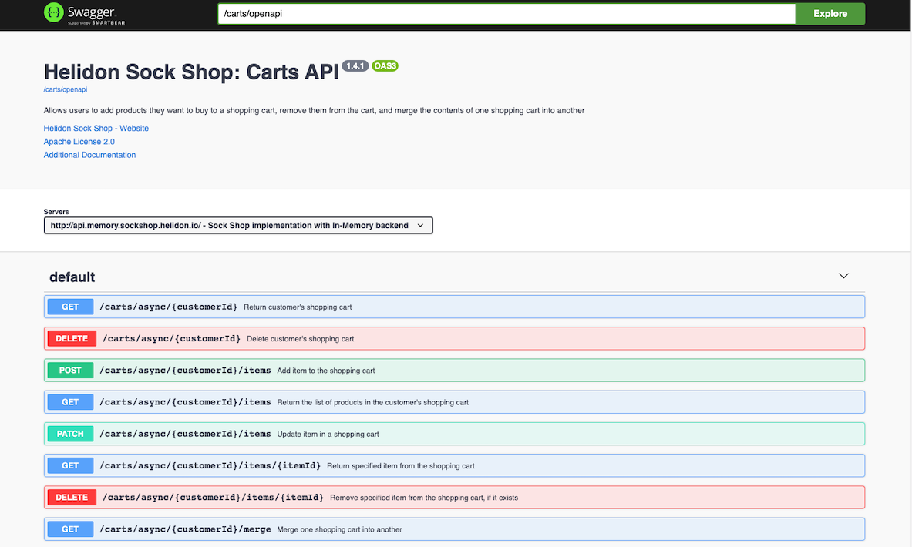

# Helidon Sock Shop 

This project is an implementation of the microservices based application
using [Helidon Microservices Framework](https://helidon.io/).

The application is an online store that sells, well, socks, and is based
on the canonical [SockShop Microservices Demo](https://microservices-demo.github.io)
originally written and published under Apache 2.0 license by [Weaveworks](https://go.weave.works/socks).

You can see a working demo of the original application [here](http://socks.weave.works/).

This demo still uses the original front end implementation provided by Weaveworks,
but all back end services have been re-implemented from scratch to use Helidon MP 
and showcase its features and best practices.

# Table of Contents

* [Architecture](#architecture)
* [Project Structure](#project-structure)
* [Pre-Requisites](#pre-requisites)
* [Quick Start](#quick-start)
* [Complete Application Deployment](#complete-application-deployment)
  * [Additional Pre-Requisites](#additional-pre-requisites)
  * [Install Prometheus and Grafana](#install-prometheus-and-grafana)
  * [Expose Application via a Load Balancer](#expose-application-via-a-load-balancer)
  * [Install the Jaeger Operator](#install-the-jaeger-operator)
  * [Access Swagger](#access-swagger)
  * [Cleanup](#cleanup)  
* [Development](#development)
  * [Checking Out the Project](#checking-out-the-project)
  * [Building the Code](#building-the-code)
  * [Creating Docker Images](#creating-docker-images)
  * [Running Modified Application](#running-modified-application)
* [License](#license)  


## Architecture

The application consists of 6 back end services (rewritten from the ground up on top of
Helidon, implementing the API that the legacy `front-end` service expects).



- **[Product Catalog](https://github.com/helidon-sockshop/catalog)**, which provides 
REST API that allows you to search product catalog and retrieve individual product details;

- **[Shopping Cart](https://github.com/helidon-sockshop/carts)**, which provides 
REST API that allows you to manage customers' shopping carts;

- **[Orders](https://github.com/helidon-sockshop/orders)**, which provides REST API 
that allows customers to place orders;

- **[Payment](https://github.com/helidon-sockshop/payment)**, which provides REST API 
that allows you to process payments;

- **[Shipping](https://github.com/helidon-sockshop/shipping)**, which provides REST API 
that allows you to ship orders and track shipments;

- **[Users](https://github.com/helidon-sockshop/users)**, which provides REST API 
that allows you to manage customer information and provides registration and 
authentication functionality for the customers.

Each service has a _core_ module, which is where most of the code for the service is
(domain model, JAX-RS resources, etc.), and which also provides a basic in-memory
implementation of the data store that is useful for testing.

All services also have one or more data store-specific modules, which build on the
_core_ module and demonstrate integrations of popular data stores with Helidon 
(Coherence, MySQL, Mongo, Redis, etc.)
 
You can find more details for each service within documentation pages for individual
services, which can be accessed using the links above.

## Project Structure

Each back end service described above has its own Github repo, so it can be versioned
and released independently from other services. 

In addition to that, there is also a main 
[Sock Shop](https://github.com/helidon-sockshop/sockshop) repository (the one you are 
currently in), which contains Kubernetes deployment files for the whole application, 
top-level POM file which allows you to easily build the whole project and import it 
into your favorite IDE, and a _bash_ script that makes it easy to checkout and update 
all project repositories at once.

## Pre-Requisites

If you are going to install a `coherence` back-end or support for Prometheus and Grafana you
will need to carry out the following:

1. Install `helm`

    You must have at least version `v2.14.3` of `helm`. See [here](https://helm.sh/docs/intro/install/)
    for information on installing `helm` for your platform.
    
    > Note: The `helm` commands below are for helm 3.3.

1. Add the following `helm` repositories

    ```bash
    $ helm repo add stable https://kubernetes-charts.storage.googleapis.com/
    $ helm repo add coherence https://oracle.github.io/coherence-operator/charts
    $ helm repo update
    ```   

## Quick Start

Kubernetes scripts depend on Kustomize, so make sure that you have a newer 
version of `kubectl` that supports it (at least 1.14 or above).
   
The easiest way to try the demo is to use Kubernetes deployment scripts from this repo. 

If you do, you can simply run the following command from the `sockshop` directory
and set the `SOCKSHOP_BACKEND` variable to one of the following values, 
indicating the type of back-end you want to deploy.

* `core` - In-memory only back-end
* `coherence` - Coherence back-end
* `mongo` - MongoDB back-end
* `mysql` - MySQL database back-end 
* `redis` - Redis back-end

We create a namespace called `sockshop-${SOCKSHOP_BACKEND}` so we can deploy multiple 
back-ends at a time.

Choose one of the following options:
* **Installing non-Coherence Back-end**

    ```bash
    $ export SOCKSHOP_BACKEND=core
    
    $ kubectl create namespace sockshop-${SOCKSHOP_BACKEND}
    namespace/sockshop-core created
    
    $ kubectl apply -k k8s/${SOCKSHOP_BACKEND} --namespace sockshop-${SOCKSHOP_BACKEND}
    ``` 

* **Installing a Coherence Back-end**

    ```bash
    $ export SOCKSHOP_BACKEND=coherence
    
    $ kubectl create namespace sockshop-${SOCKSHOP_BACKEND}
    namespace/sockshop-coherence created  
     
    $ helm install --namespace sockshop-${SOCKSHOP_BACKEND} --version 3.0.0 \
                   coherence-operator coherence/coherence-operator

    $ kubectl apply -k k8s/${SOCKSHOP_BACKEND} --namespace sockshop-${SOCKSHOP_BACKEND}
    ```  
  
> Note: The above helm command is for helm version 3, use the following command
> If you are using helm version 2:
> ```bash
> $ helm install coherence/coherence-operator --version 3.0.0 \
>       --namespace sockshop-${SOCKSHOP_BACKEND} --name coherence-operator   
> ```  

This will merge all the files under the specified directory and create all Kubernetes 
resources defined by them, such as deployment and service for each microservice.

### (Optional) Install the Original WeaveSocks Front End

> Warning: The original WeaveSocks Front End has a few bugs, as well as some security issues, 
> and it hasn't been actively maintained for a few years. However, if you want to deploy
> it nevertheless to see how it interacts with our back-end services, please follow
> the steps below.
   
Install the `front-end` service by running the following command:

```bash
$ kubectl apply -f k8s/optional/original-front-end.yaml --namespace sockshop-${SOCKSHOP_BACKEND}
``` 
   
Port-forward to the `front-end` UI using the following

**Mac/Linux**

```bash
$ export FRONT_END_POD=$(kubectl get pods --namespace sockshop-${SOCKSHOP_BACKEND} -o jsonpath='{.items[?(@.metadata.labels.app == "front-end")].metadata.name}')
$ kubectl port-forward --namespace sockshop-${SOCKSHOP_BACKEND} $FRONT_END_POD 8079:8079
```

**Windows**

```bash
kubectl get pods --namespace sockshop-%SOCKSHOP_BACKEND% -o jsonpath='{.items[?(@.metadata.labels.app == "front-end")].metadata.name}' > pod.txt
SET /P FRONT_END_POD=<pod.txt
kubectl port-forward --namespace sockshop-%SOCKSHOP_BACKEND% %FRONT_END_POD% 8079:8079
```

> Note: If you have installed into a namespace then add the `--namespace` option to all `kubectl` commands in these instructions.

You should be able to access the home page for the application by pointing your browser to http://localhost:8079/.

You should then be able to browse product catalog, add products to shopping cart, log in as an 
existing test user (username: `user`, password: `pass`) or register as a new user, place an order,
browse order history, etc.

Once you are finished, you can clean up the environment by executing the following:

```bash
$ kubectl delete -f k8s/optional/original-front-end.yaml --namespace sockshop-${SOCKSHOP_BACKEND}
$ kubectl delete -k k8s/${SOCKSHOP_BACKEND} --namespace sockshop-${SOCKSHOP_BACKEND} 
``` 

### Scale the Coherence Back-End

If you wish to scale the Coherence back-end you can issue the following command

```bash
$ export SOCKSHOP_BACKEND=coherence
      
# Scale the orders statefulset
$ kubectl scale coherence --namespace sockshop-${SOCKSHOP_BACKEND} orders --replicas=3 

# Scale all statefulsets 
$ for pod in carts catalog orders payment shipping users
    do kubectl scale coherence --namespace sockshop-${SOCKSHOP_BACKEND} $pod --replicas=3
done
```  

## Complete Application Deployment

The Quick Start shows how you can run the application locally, but that may not 
be enough if you want to experiment by scaling individual services, look at tracing data in Jaeger, 
monitor services via Prometheus and Grafana, or make API calls directly via Swagger UI.

To do all of the above, you need to deploy the services into a managed Kubernetes cluster 
in the cloud, by following the same set of steps described above (except for port forwarding, 
which is not necessary), and performing a few additional steps.

### Additional Pre-Requisites 

1. Install `envsubst` 

    You must download and install `envsubst` for your platform from 
    [https://github.com/a8m/envsubst](https://github.com/a8m/envsubst) and make it
    available in your `PATH`.

### Install Prometheus and Grafana

The following will install [Prometheus Operator](https://github.com/coreos/prometheus-operator/) into the 
`monitoring` namespace using `helm`.
   
1. Create the `monitoring` namespace

    If you wish to install Prometheus or Jaegar Operator you must create the `monitoring` namespace using the following:

    ```bash
    $ kubectl create namespace monitoring
    ```

1. Create Prometheus pre-requisites

    ```bash
    $ kubectl apply -f k8s/optional/prometheus-rbac.yaml  
    ```                            
   
1. Create Config Maps

    ```bash
    $ kubectl --namespace monitoring create configmap sockshop-grafana-dashboards --from-file=k8s/optional/grafana-dashboards/
             
    $ kubectl --namespace monitoring label configmap sockshop-grafana-dashboards grafana_dashboard=1  
   
    $ kubectl --namespace monitoring create -f k8s/optional/grafana-datasource-config.yaml  
   
    $ kubectl --namespace monitoring label configmap sockshop-grafana-datasource grafana_datasource=1  

    $ kubectl --namespace monitoring create -f https://oracle.github.io/coherence-operator/dashboards/3.0.0/coherence-grafana-dashboards.yaml

    $ kubectl --namespace monitoring label configmap coherence-grafana-dashboards grafana_dashboard=1
    ```     
   
1. Install Prometheus Operator

    > Note: If you have already installed Prometheus Operator before on this Kuberenetes Cluster
    > then set `--set prometheusOperator.createCustomResource=false`.

    ```bash
    $ helm install --namespace monitoring --version 8.13.9 \
        --set grafana.enabled=true \
        --set prometheusOperator.createCustomResource=true \
        --values k8s/optional/prometheus-values.yaml prometheus stable/prometheus-operator 
    ````    
   
    For helm version 2 use the following:

    ```bash
    $ helm install --namespace monitoring --version 8.13.9 \
        --set grafana.enabled=true --name prometheus \
        --set prometheusOperator.createCustomResource=true \
        --values k8s/optional/prometheus-values.yaml stable/prometheus-operator 
    ```
   
   **IMPORTANT**
   
   If you installed the Coherence back-end before you installed Prometheus Operator, you must
   run the following to delete and re-add the deployments for Prometheus to pickup the Pods.
   
   ```bash 
   $ export SOCKSHOP_BACKEND=coherence
   
   $ kubectl delete -k k8s/${SOCKSHOP_BACKEND} --namespace sockshop-${SOCKSHOP_BACKEND} 
   
   $ kubectl apply -k k8s/${SOCKSHOP_BACKEND} --namespace sockshop-${SOCKSHOP_BACKEND} 
   ```

### Expose Application via a Load Balancer 

> Note: This is assuming you have deployed one of the back-ends via the instructions in
> the previous section.                              

1. Create the Load Balancer

    ```bash
    $ kubectl apply -f k8s/optional/ingress-controller.yaml 
    
    $ kubectl get services --namespace ingress-nginx
    NAME            TYPE           CLUSTER-IP       EXTERNAL-IP       PORT(S)                      AGE
    ingress-nginx   LoadBalancer   AAA.BBB.CCC.DDD   WWW.XXX.YYY.ZZZ  80:31475/TCP,443:30578/TCP   17s    
    ```      

    Once you have been assigned an external IP address, continue to the next step.              

1. Setup Domains

    You must have access to a top level domain for which you can create sub-domains to 
    allow access to the application via a Load Balancer (LB).

    For example if your top level domain is `mycompany.com` then you
    should create a single wildcard DNS entry `*.sockshop.mycompany.com` to 
    point to your external load balancer IP address.
     
1. Create the ingress

    Each time you use a different back-end you will need to create a new ingress.

    In your terminal, export (or SET for Windows) your top level domain
    and the backend you are using. 
    
    For example for domain `sockshop.mycompany.com` and `core` backend, use the following 
    
    ```bash
    $ export SOCKSHOP_DOMAIN=sockshop.mycompany.com
    $ export SOCKSHOP_BACKEND=core                            
    
    $ envsubst -i k8s/optional/ingress.yaml | kubectl apply --namespace sockshop-${SOCKSHOP_BACKEND} -f -
    
    $ kubectl get ingress --namespace sockshop-${SOCKSHOP_BACKEND}  
    
    NAME               HOSTS                                                                                            ADDRESS           PORTS   AGE
    mp-ingress         mp.core.sockshop.mycompany.com                                                                   XXX.XXX.XXX.XXX   80      12d
    sockshop-ingress   core.sockshop.mycompany.com,jaeger.core.sockshop.mycompany.com,api.core.sockshop.mycompany.com   XXX.XXX.XXX.XXX   80      12d
    ```   
   
1. Install a Service Monitor 

    > Note: This is only required for non `coherence` backends.
                                  
    Each time you use a different back-end you will need to create a new service monitor.
    
    As for the ingress above, ensure you have set the `SOCKSHOP_BACKEND` environment variable. 
  
    ```bash
    $ envsubst -i k8s/optional/prometheus-service-monitor.yaml | kubectl create --namespace monitoring -f -
    ```
    
1. Create the ingress for Grafana and Prometheus

    Ensuring you have the `SOCKSHOP_DOMAIN` environment variable set and issue the following:
    
    ```bash
    $ envsubst -i k8s/optional/ingress-grafana.yaml | kubectl apply --namespace monitoring -f - 
   
    $ kubectl get ingress --namespace monitoring                                         
   
    NAME              HOSTS                                                             ADDRESS          PORTS   AGE
    grafana-ingress   grafana.sockshop.mycompany.com,prometheus.sockshop.mycompany.com  XXX.YYY.XXX.YYY  80      12s
    ```     
    
    The following URLs can be used to access Grafana and Prometheus:
    * http://grafana.sockshop.mycompany.com/ - username: `admin`, initial password `prom-operator`
    * http://prometheus.sockshop.mycompany.com/  

1. Access the application

    Access the application via the endpoint http://core.sockshop.mycompany.com/ 

### Install the Jaeger Operator
            
1. Install the Jaeger Operator
 
    The command below will create `monitoring` namespace and install Jaeger Operator into it. 
    You only need to do this once, regardless of the number of backends you want to deploy.
            
    ```bash
    $ kubectl create -f k8s/optional/jaeger-operator.yaml
    ```

1. Deploy All-in-One Jaeger Instance

    This is required for each back-end namespace.
    
    ```bash
    $ kubectl create -f k8s/optional/jaeger.yaml --namespace sockshop-${SOCKSHOP_BACKEND}
    ```                                         

1. Exercise the Application and access Jaeger

    Cessing the Jaeger UI at http://jaeger.core.sockshop.mycompany.com/,
    you should see the trace information similar to the images below, allowing you 
    to see how long each individual operation in the call tree took.
    
       

         

### Access Swagger

1. Deploy Swagger UI

    This is required for each back-end namespace.
    
    ```bash
    $ kubectl create -f k8s/optional/swagger.yaml --namespace sockshop-${SOCKSHOP_BACKEND}
    ```    
   
   Access the Swagger UI at http://mp.core.sockshop.mycompany.com/swagger/.
   
   Enter /carts/openapi into the Explore field at the top of the screen and click on Explore button. 
   You should see the screen similar to the following, showing you all the endpoints for the Carts 
   service (and their payloads), and allowing you to make API requests to it directly from your browser.
   
                                          

### Cleanup

1. Cleanup the ingress for applications

    To cleanup the ingress for your deployment, execute the following: 
    for each `SOCKSHOP_BACKEND` you previously installed: 

    ```bash 
    $ export SOCKSHOP_DOMAIN=sockshop.mycompany.com  
    $ export SOCKSHOP_BACKEND=core                             
    
    $ envsubst -i k8s/optional/ingress.yaml| kubectl delete -f - --namespace sockshop-${SOCKSHOP_BACKEND}
    ```       
   
1. Cleanup the ingress for Grafana and Prometheus
   
    If you installed Prometheus Operator, execute the following:
    
    ```bash
    $ envsubst -i k8s/optional/ingress-grafana.yaml | kubectl delete --namespace monitoring -f - 
    ```
   
1. Remove the deployed services

    To cleanup the deployed services, execute the following
    for each `SOCKSHOP_BACKEND` you previously installed: 
   
    ```bash   
    $ export SOCKSHOP_DOMAIN=sockshop.mycompany.com  
    $ export SOCKSHOP_BACKEND=core
    $ kubectl delete -k k8s/${SOCKSHOP_BACKEND} --namespace sockshop-${SOCKSHOP_BACKEND} 
    ```  
    
1. Remove the Load Balancer 
    
    If you wish to remove your load balancer, execute the following:
    
    ```bash
    $ kubectl delete -f k8s/optional/ingress-controller.yaml
    ```

1. Remove Jaeger

    ```bash
    $ kubectl delete -f k8s/optional/jaeger-operator.yaml 
    ```   
    
    For each namespace you installer Jaeger into, execute the following:
    
    ```bash
    $ kubectl delete -f k8s/optional/jaeger.yaml --namespace sockshop-${SOCKSHOP_BACKEND}
    ```   

1. Remove Swagger

    For each namespace you installer Swagger into, execute the following:

    ```bash
   $ kubectl delete -f k8s/optional/swagger.yaml --namespace sockshop-${SOCKSHOP_BACKEND} 
    ```  
   
1. Remove Prometheus and Grafana 

    To cleanup the service monitors, execute the following
    for each `SOCKSHOP_BACKEND` you previously installed: 
   
    ```bash
    $ envsubst -i k8s/optional/prometheus-service-monitor.yaml | kubectl delete --namespace monitoring -f -
    ```

   To remove the Prometheus Operator, execute the following:
    
    ```bash
    $ helm delete prometheus --namespace monitoring     
   
    $ kubectl --namespace monitoring delete configmap sockshop-grafana-dashboards   

    $ kubectl --namespace monitoring delete configmap coherence-grafana-dashboards

    $ kubectl --namespace monitoring delete configmap sockshop-grafana-datasource
   
    $ kubectl --namespace monitoring delete -f k8s/optional/grafana-datasource-config.yaml
   
    $ kubectl delete -f k8s/optional/prometheus-rbac.yaml 
    ```
   
    For helm version 2 use the following:
   
    ```bash
    $ helm delete prometheus --purge   
    ```
 
   > Note: You can optionally delete the Prometheus Operator Custom Resource Definitions
   > (CRD's) if you are not going to install Prometheus Operator again. 
   
   ```bash
   $ kubectl delete crd alertmanagers.monitoring.coreos.com 
   $ kubectl delete crd podmonitors.monitoring.coreos.com
   $ kubectl delete crd prometheuses.monitoring.coreos.com
   $ kubectl delete crd prometheusrules.monitoring.coreos.com 
   $ kubectl delete crd prometheusrules.monitoring.coreos.com 
   $ kubectl delete crd servicemonitors.monitoring.coreos.com 
   $ kubectl delete crd thanosrulers.monitoring.coreos.com 
   ```   
   
   A shorthand way of doing this if you are running Linux/Mac is:
   ```bash
   $ kubectl get crds --namespace monitoring | grep monitoring.coreos.com | awk '{print $1}' | xargs kubectl delete crd
   ``` 
   
1. Remove the Coherence Operator

    If you installed a `coherence` back-end then you must also un-install using the following:
    
    ```bash
    $ helm delete coherence-operator --namespace sockshop-${SOCKSHOP_BACKEND}  
    ```
   
    For helm version 2 use the following:
    
    ```bash
    $ helm delete coherence-operator --purge
    ```
                                                                                                                                                                                                                                       
## Development
 
If you want to modify the demo, you will need to check out the code for the project, build it 
locally, and (optionally) push new Docker images to the repository of your choice.
 
### Checking Out the Project

The easiest way to checkout the source code for all the services is to run the provided 
`update.sh` script:

```bash
$ mkdir helidon-sockshop
$ cd helidon-sockshop
$ bash <(curl -s https://raw.githubusercontent.com/helidon-sockshop/sockshop/master/update.sh)
```

Once you have the code locally, you can update it to the latest version by running the 
same script locally:

```bash
$ cd helidon-sockshop
$ sockshop/update.sh
```

>**Note:** Make sure that you run the update script from the same top-level directory 
>that you used to checkout all the services into or it will fail.

### Building the Code

You can build individual services by running `mvn clean install` within top-level directory
for each service, but if you want to build the whole project at once, there is an easier
way: simply run `mvn clean install` within the `sockshop` directory.

This will compile the code for each service, run the tests, and install module JARs into
the local Maven repo. 

### Creating Docker Images

Pre-built Docker images are already available on [DockerHub](https://hub.docker.com/orgs/helidonsockshop/repositories),
so you can simply run `docker pull` to download them and use locally.

However, if you are making changes to various service implementations and need to re-create
Docker images, you can easily do that in several different ways.

If you only want to build Docker images locally, make sure that you have Docker Daemon
running and execute the following: 

```bash
$ mvn package -Pdocker -DskipTests
```

You can then tag images any way you want and push them to a Docker repo of your choice 
using standard Docker commands.

On the other hand, if you cannot or do not want to run Docker locally, you can push images
directly to the remote repository:

```bash
$ mvn package -Pdocker -DskipTests -Ddocker.repo=<your_docker_repo> -Djib.goal=build
```

> **Note:** You should replace `<your_docker_repo>` in the command above with the name of the 
> Docker repository that you can push Docker images to.

> **Note:** We use [Jib Maven Plugin](https://github.com/GoogleContainerTools/jib) to create and publish
> Docker images, with a default Jib goal set to `dockerBuild`, in order to create local image.
> Changing the goal to `build` via `jib.goal` system property allows you to push images to a 
> remote repository directly.

### Running Modified Application

Kubernetes deployment scripts in this repository reference Docker images from the default
Docker Hub repository, `helidon/sockshop`. You will not be able to push the images to that repo,
which is why you had to specify `-Ddocker.repo` argument in the command above.

In order to deploy the application that uses your custom Docker images, you will also have to modify
relevant `deployment.yaml` files within `sockshop` repository to use correct names for your
Docker images.

## License

The Universal Permissive License (UPL), Version 1.0
